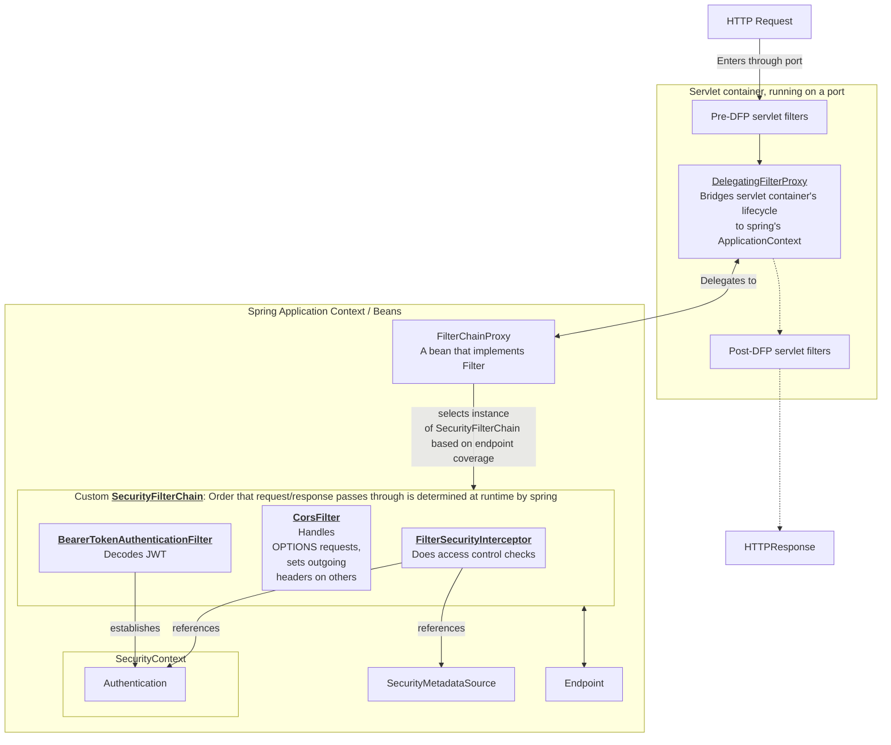
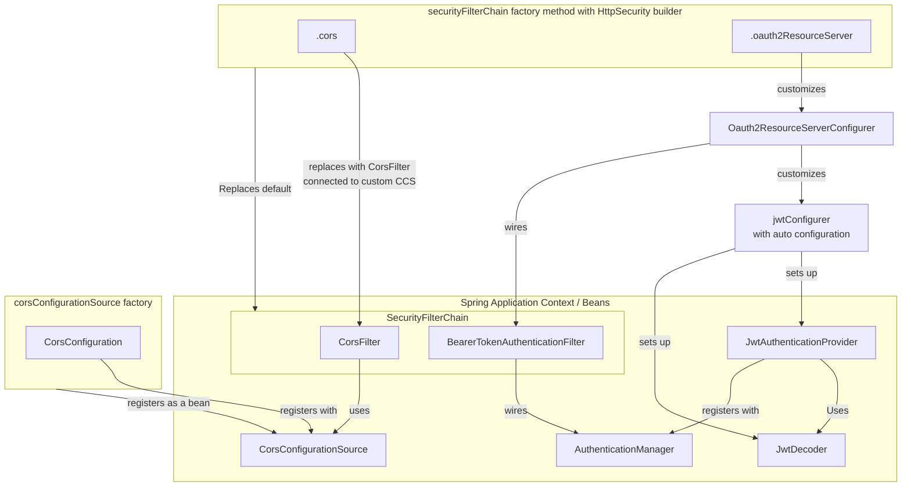
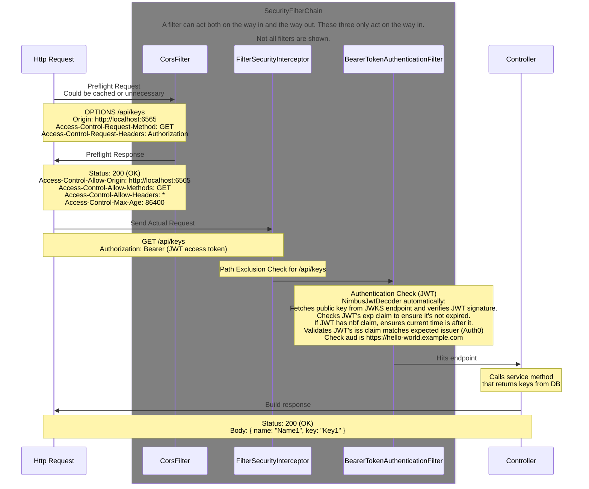
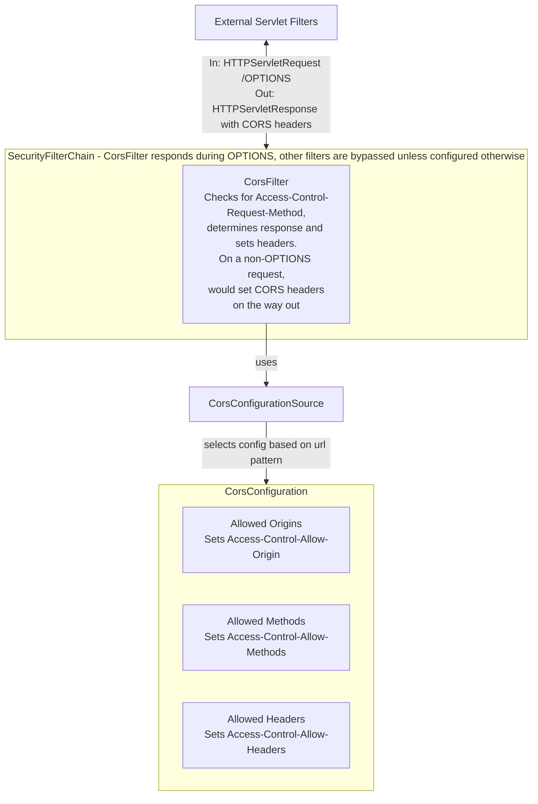
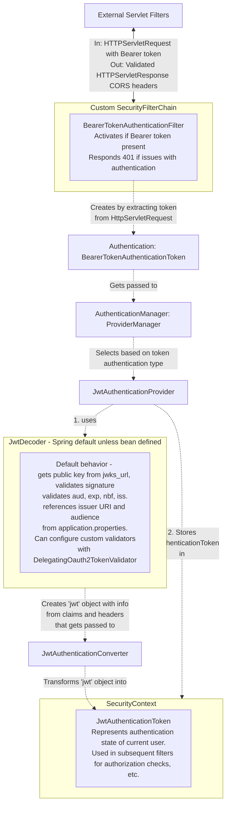

### How the Filters work in Spring Security

### How the Factory methods in SecurityConfig set up the spring security structure

---

## Backend authentication:

### How OPTIONS Requests are handled in the SecurityFilterChain

### Non-OPTIONS Requests in the SecurityFilterChain

